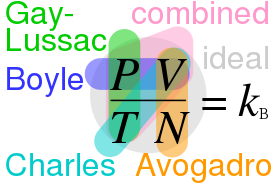

\begin{center}
{\Huge Química}

{\Large Formulario}
\end{center}
\tableofcontents
\newpage

\Begin{multicols}{2}

# Conversiones

### Peso

$\text{1 lb}=\text{453,6 g}$

$\text{1 kg}=\text{2,2 lb}$

$\text{1 oz}=\text{28,35 g}$

### Longitud

$\text{1 mi}=\text{1,61 km}$

$\text{1 m}=\text{3,28 ft}$

$\text{1 m}=39,4^{"}$

$1^{"}=\text{2,54 cm}$

### Gases

$\text{1 atm}=\text{760 mmHg}$

$\text{1 atm}=\text{101,3 kPa}$

$\text{1 atm}=\text{14,696 psi}$

$\text{1 torr}=\text{1 mmHg}$

$\text{1 torr}=\text{133,32 Pa}$

$\text{1 bar}=10^{5}\text{ Pa}$

### Termodinámica

$\text{1 cal}=\text{4,18 J}$

$\text{1 atmL}=\text{101,3 J}$

# Propiedades intensivas

$m=dv$

> (s), (l) = g/cm³; (g) = g/m³

$\textcelsius=(F-32)\frac{5}{9}$

$F=\frac{9}{5}\textcelsius+32$

$K=\textcelsius+273,15$

# Estequiometría

### Unidades de cantidad

$1uma=\frac{g}{mol}$

> El peso atómico se mide en uma's.

$1g=6,022{\cdot}10^{23}uma$

$N_{A}/L=6,022{\cdot}10^{23}\text{partículas}$

### Isótopo

$\bar{m}=m_{1}Ab_{1}+...+m_{n}Ab_{n}$

### Composición porcentual

$Mr={\Sigma}Ar$

$\%X=\frac{nAr}{Mr}100\%$

### Fórmulas químicas

$FM=nFE$

$m=nMr$

# Reacciones

### Rendimiento

$\%r=\frac{\text{real}}{\text{teórico}}100\%$

# Soluciones

$C_1V_1=C_2V_2$

$m_{\text{solución}}=m_{soluto}+m_{solvente}$

$V_{\text{solución}}=V_{soluto}+V_{solvente}$

### Molaridad $(M)$

$M=\frac{n_{soluto}}{{\langle}1{\rangle}{dm^3}_{\text{solución}}}$

### Molalidad $(\eta)$

$\eta=\frac{n_{soluto}}{{\langle}1{\rangle}kg_{solvente}}$

### Fracción molar $(X)$

$X_{A}=\frac{n_{A}}{{\langle}1{\rangle}n_{\text{solución}}}$

$X_{B}=\frac{n_{B}}{{\langle}1{\rangle}n_{\text{solución}}}$

$X_{A}+X_{B}=1$

### Porcentaje en masa $(m_\%)$

$m_\%=\frac{g_{soluto}}{{\langle}100{\rangle}g_{\text{solución}}}{\cdot}100\%$

### Porcentaje en volumen $(V_\%)$

$V_\%=\frac{V_{soluto}}{V_{\text{solución}}}{\cdot}100\%$

### Partes por millón $(ppm)$

$m_\%=\frac{m_{soluto}}{m_{\text{solución}}}{\cdot}10^6$

# Gases

$R=8,314\frac{J}{K{\cdot}mol}$
$R=0,0821\frac{atm{\cdot}L}{K{\cdot}mol}$

> Condiciones normales (CNTP): 1 atm, 0ºC
>
> Condiciones estándar (TPE): 1 atm, 25ºC (temperatura ambiente)

### Ley de los gases ideales

$PV=nRT$

### Ecuación de estado

$\frac{P_{1}V_{1}}{n_{1}T_{1}}=\frac{P_{2}V_{2}}{n_{2}T_{2}}$

{ width=20% }

### Densidad de un gas

$\rho=\frac{MrP}{RT}$

### Ley de Dalton

$P_{A}=X_{A}P_{T}$

$P_{A}=\frac{n_{A}RT}{V}$

### Volumen molar de un gas

$1mol=22,7dm^{3}$

> Posible a CNTP.

# Termodinámica

### Trabajo y energía

$W=-P{\Delta}V\Leftrightarrow W=-{\Delta}nRT$

${\Delta}U=Q+W$

> $\begin{matrix}\text{\small{recibe}} & + \\ \text{\small{libera}} & -\end{matrix}$

### Entalpía

${\Delta}H=H_{productos}-H_{reactivos}$

**Entalpía estándar de formación**

${\Delta}H_{f}^\circ$

**Entalpía estándar de reacción**

${\Delta}H_{rxn}^\circ=[c{\Delta}H_{f}^\circ(C)+d{\Delta}H_{f}^\circ(D)]-[a{\Delta}H_{f}^\circ(A)+b{\Delta}H_{f}^\circ(B)]$

### Calor

$-Q_1=Q_2$

$Q=mc{\Delta}T$

$C=mc$

$c_{H_{2}O}=4,184\frac{J}{g\textcelsius}$

### Cálculos de un sistema

$Q_{sis}={\Sigma}Q_{\text{Componentes}}$

**Componentes**

$Q_{sis}=0\Leftrightarrow\text{ningún calor entra o sale}$

$Q_{H_{2}O}=mc{\Delta}T$

$Q_{\text{aparato}}=C_{\text{aparato}}{\Delta}T$

<u>Reacción a P constante</u>

$Q_{\text{rxn}}={\Delta}H$

<u>Reacción a V constante</u>

$Q_{\text{rxn}}={\Delta}U$

### Entalpía de una solución

${\Delta}H_{\text{soln}}=E+{\Delta}H_{\text{hidratación}}$

${\Delta}H_{\text{soln}}=H_{\text{solución}}-H_{\text{componentes}}$

${\Delta}H_{\text{soln}}=\Sigma{\Delta}H$

> ${\Delta}H>{\Delta}E→\text{compresión}$
>
> ${\Delta}H<{\Delta}E→\text{expansión}$
>
> ${\Delta}H={\Delta}E→\text{rxn que no produce cambio en moles}$
>
> ${\Delta}H_{\text{soln}}=0→\text{solución ideal}$

### Cambio de fases

${\Delta}H_{sub}={\Delta}H_{fus}+{\Delta}H_{vap}$

### Propiedades coligativas

> $^\circ=\text{puro}$
>
> $_1=\text{solvente}$
>
> $_2=\text{soluto}$

$\text{Factor de Van't Hoff }(i)=\frac{\text{\# partículas productos}}{\text{\# partículas reactivos}}$

> Para no electrolitos es igual a uno.

**Disminución de presión de vapor**

$P_1=X_1P_1^\circ$

${\Delta}P=X_2P_1^\circ$

${\Delta}P=P_1^\circ-P_1$

**Elevación del punto de ebullición**

${\Delta}T_b=ik_{b_1}\eta$

${\Delta}T_b=T_{b_2}-T_{b_1}^\circ$

$T_b>T_b^\circ→{\Delta}T_b>0$

**Disminución del punto de ebullición**

${\Delta}T_f=ik_{f_1}\eta$

${\Delta}T_f=T_{f_2}^\circ-T_{f_1}$

$T_f^\circ>T_f→{\Delta}T_f>0$

**Presión osmótica**

$\pi=iMRT$

# Equilibrio químico

$K_c=\frac{[C]^c[D^d]}{[A]^a[B]^b}$

$K_P=\frac{P_C^cP_D^d}{P_A^aP_B^b}$

$K_P=K_c(RT)^{{\Delta}n}$

---

$K_c=K_c^{\prime}K_c^{\prime\prime}$

$n(rxn)=K_c^n$

$\text{cambio de dirección }(rxn)=\frac{1}{K_c}$

---

$\begin{matrix} \text{se favorece los productos} & Q_c<K_c \\ rxn\text{ está en equilibrio} & Q_c=K_c \\ \text{se favorece los reactivos} & Q_c>K_c \end{matrix}$

\End{multicols}
