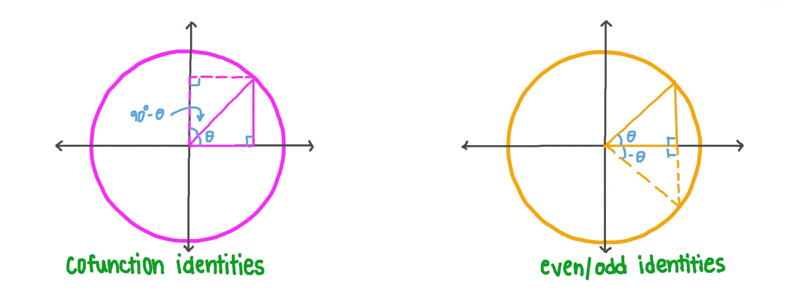

# Definiciones

### Valor absoluto

$$
\sqrt{x^2}=|x|
$$

**Ejemplo**
$$
x^2=20
$$

$$
\sqrt{x^2}=\sqrt{20}
$$

$$
|x|=\sqrt{20}
$$

$$
x=\pm\sqrt{20}
$$

# Conjunto de valores admisibles (C.V.A)

$$
\frac{1}{f(x)};f(x)\ne0
$$

$$
\sqrt{f(x)};f(x)\ge0
$$

$$
\log_a f(x);f(x)>0
$$

$$
a^x;a>0,a\ne1,x\in\mathbb{R}
$$

# Inecuaciones

### Valor absoluto

**$b\ge0$**

| $|a|<b$ | $-b<a<b$ |
| ------- | -------- |
| $|a|>b$ | $b<a<-b$ |

**$b<0$**

| $|a|<b$ | $\text{no hay solución}$ |
| ------- | ------------------------ |
| $|a|>b$ | $\mathbb{R}$             |

# Propiedades logarítmicas

$$
x=log_a(n)\ {\Leftrightarrow}\ a^x=n
$$

---

$$
log_an^k=klog_an
$$

$$
log\ xy=log\ x+log\ y
$$

$$
log\left(\frac{x}{y}\right)=log x-log\ y
$$

---

$$
log_bn=\frac{log_an}{log_ab}
$$

$$
log_aa^x=x
$$

$$
a^{log_ax}=x
$$

---

$$
log_aa=1
$$

$$
log_a1=0
$$

$$
log_a0=\text{indefinido}
$$

# Trigonometría

### Medidas de ángulos en grados y radianes

| 30º $(\theta)$ | Radianes                          | Radianes (simplificado) | 45º $(\theta)$ | Radianes                          | Radianes (simplificado) |
|----------------|-----------------------------------|-------------------------|----------------|-----------------------------------|-------------------------|
| $30^\circ$     | $\frac{\textcolor{red}{1}\pi}{6}$ | $\frac{\pi}{6}$         | $45^\circ$     | $\frac{\textcolor{red}{1}\pi}{4}$ | $\frac{\pi}{4}$         |
| $60^\circ$     | $\frac{\textcolor{red}{2}\pi}{6}$ | $\frac{\pi}{3}$         | $90^\circ$     | $\frac{\textcolor{red}{2}\pi}{4}$ | $\frac{\pi}{2}$         |
| $n^\circ$      | $\frac{\textcolor{red}{k}\pi}{6}$ |                         | $n^\circ$      | $\frac{\textcolor{red}{k}\pi}{4}$ |                         |

$$
k=\frac{n^\circ}{\theta}
$$

### Tabla trigonométrica

| $\theta$     | 0º  | 30º                  | 45º                  | 60º                  | 90º      |
|--------------|-----|----------------------|----------------------|----------------------|----------|
| $\sin\theta$ | $0$ | $\frac{1}{2}$        | $\frac{\sqrt{2}}{2}$ | $\frac{\sqrt{3}}{2}$ | $1$      |
| $\cos\theta$ | $1$ | $\frac{\sqrt{3}}{2}$ | $\frac{\sqrt{2}}{2}$ | $\frac{1}{2}$        | $0$      |
| $\tan\theta$ | $0$ | $\frac{\sqrt{3}}{3}$ | $1$                  | $\sqrt{3}$           | $\infty$ |

> Recomendado: [Funk da trigonometria](https://www.youtube.com/watch?v=83gdQe0Ij5k)

**Visualización**

### Periodicidad

$$
\sin\left(2\pi+\theta\right)=\sin\theta
$$

$$
\cos\left(2\pi+\theta\right)=\cos\theta
$$

$$
\tan\left(\pi+\theta\right)=\tan\theta
$$

### Identidades trigonometricas

**Identidades pitagóricas**
$$
\sin^2\theta+\cos^2\theta=1
$$

$$
\sec^2\theta-\tan^2\theta=1
$$

$$
\csc^2-\cot^2=1
$$

**Identidades ángulo doble**
$$
\sin(2\theta)=2\sin{\theta}\cos{\theta}
$$

$$
\cos(2{\theta})=\cos^2{\theta}-\sin^2{\theta}
$$

$$
\tan(2{\theta})=\frac{2\tan{\theta}}{1-\tan^2{\theta}}
$$

### Funciones hiperbólicas

$$
\sinh x=\frac{e^x-e^{-x}}{2}
$$

$$
\cosh x=\frac{e^x+e^{-x}}{2}
$$

# Funciones

### Cuadrática

**Discriminante**

Indica el número de soluciones
$$
\Delta=b^2-4ac
$$

| $\Delta>0$ | $x=\frac{-b\pm\sqrt{\Delta}}{2a}$ |
|------------|-----------------------------------|
| $\Delta=0$ | $x=\frac{-b}{2a}$                 |
| $\Delta<0$ | $\text{no hay solución}$          |

### Combinación

$$
(f+g)x=f(x)+g(x)
$$

$$
(f-g)x=f(x)-g(x)
$$

$$
(fg)x=f(x)g(x)
$$

$$
\left(\frac{f}{g}\right)x=\frac{f(x)}{g(x)}
$$

$$
(f{\circ}g)=f(g(x))
$$

# Límites

### Leyes

$\exists\lim\limits_{x→c}f(x)\land\exists\lim\limits_{x→c}g(x)$
$$
\lim\limits_{x→c}[f(x)+g(x)]=\lim\limits_{x→c}f(x)+\lim\limits_{x→c}g(x)
$$
$$
\lim\limits_{x→c}[f(x)-g(x)]=\lim\limits_{x→c}f(x)-\lim\limits_{x→c}g(x)
$$
$$
\lim\limits_{x→c}[cf(x)]=c\lim\limits_{x→c}f(x)
$$
$$
\lim\limits_{x→c}[f(x)g(x)]=\lim\limits_{x→c}f(x)\cdot\lim\limits_{x→c}g(x)
$$
$$
\lim\limits_{x→c}\left[\frac{f(x)}{g(x)}\right]=\frac{\lim\limits_{x→c}f(x)}{\lim\limits_{x→c}g(x)};\lim\limits_{x→c}g(x)\ne0
$$

### Regla de L'Hôpital

Se puede aplicar múltiples veces mientras la condición se cumpla.

$\lim\limits_{x→c}f(x)=\frac{\infty}{\infty}\lor\lim\limits_{x→c}f(x)=\frac{0}{0}$
$$
\lim\limits_{x→c}f(x)=\frac{N^\prime}{D^\prime}
$$

**Ejemplo**

$\lim\limits_{x→2}f(x)=\frac{x^2-4x+4}{x^2+x-6}$
$$
\lim\limits_{x→c}f(x)=\frac{2x-4}{2x+1}=\frac{0}{5}=0
$$

### Límites notables

$$
\lim\limits_{n→{\pm\infty}}\frac{1}{n}=0
$$

$$
\lim\limits_{n→{\pm\infty}}(\pm)n=(\pm)\pm\infty
$$

Si un límite es igual a infinito, no existe pero se denota que tiende a infinito.
$$
\lim\limits_{x→0}\frac{\sin{x}}{x}=1
$$

$$
\lim\limits_{x→0}\frac{1-\cos{x}}{x}=0;\lim\limits_{x→0}\frac{\cos{x}-1}{x}=0
$$

$$
\lim\limits_{x→0}\frac{\sin(ax)}{bx}=\frac{a}{b}
$$

$$
\lim\limits_{x→-\infty}\arctan{x}=-\frac{\pi}{2};\lim\limits_{x→+\infty}\arctan{x}=\frac{\pi}{2}
$$

### Casos en los que no existe

**El límite izquierdo no es igual al derecho**
$$
\lim\limits_{x→c^+}\ne\lim\limits_{x→c^-}
$$
**Función que oscila alrededor de $c$**

<u>Ejemplo</u>

$c=0$
$$
\lim\limits_{x→c}=\sin\left(\frac{n}{x}\right)
$$
**Función que oscila hacia el infinito**

<u>Ejemplo</u>
$$
\lim\limits_{x→\infty}=\sin(x)
$$

### Continuidad

$$
f(a)=n\ {\Leftrightarrow}\ \exists\lim\limits_{x→a}f(x)=n
$$

> Función es continua != Función es continua en un punto. Para saber si $f$ es continua se debe evaluar el dominio.

### Cálculo de asíntotas

**Asíntota horizontal**
$$
\lim\limits_{x→-\infty}f(x);\lim\limits_{x→+\infty}f(x)
$$
**Asíntota vertical**
$$
\text{ es asíntota horizontal}\ \Leftrightarrow\ \lim\limits_{x→c}f(x)=\infty
$$

### Teorema del sandwich

$$
f(x){\le}h(x){\le}g(x)
$$

$$
\lim\limits_{x→c}f(x)=\alpha\land\lim\limits_{x→c}g(x)=\alpha\ {\Longleftrightarrow}\ \lim\limits_{x→c}h(x)=\alpha
$$

# Derivadas

$$
f^\prime(x)=\lim\limits_{h→0}\frac{f(x+h)+f(x)}{h}
$$

### Casos en los que no se puede derivar (punto)

1. Recta tangente es vertical
2. $f$ es discontinua
3. "Giro" brusco

### Derivadas notables

| Función        | Derivada                                 |
|----------------|------------------------------------------|
| $f(x)=ax$      | $f(x)=a(x)^\prime$                       |
| $f(x)=x^n$     | $f^\prime(x)=nx^{n-1}$                   |
| $f(x)=a^x$     | $f^\prime(x)=a^x\ln a$                   |
| $f(x)=e^x$     | $f^\prime(x)=e^x$                        |
| $f(x)=\sin x$  | $f^\prime(x)=\cos x$                     |
| $f(x)=\cos x$  | $f^\prime(x)=-\sin x$                    |
| $f(x)=\tan x$  | $f^\prime(x)=\sec^2 x$                   |
| $f(x)=\ln x$   | $f^\prime(x)=\frac{1}{x}$                |
| $f(x)=\log_ax$ | $f^\prime(x)=\frac{1}{\ln a}\frac{1}{x}$ |

### n-ésima derivada

| Función     | Derivada               |
|-------------|------------------------|
| $f(x)=xe^x$ | $f^{(n)}(x)=ne^x+xe^x$ |

### Recta tangente, normal

La pendiente de la recta tangente es igual a la derivada evaluada en una constante.

$m_{L_T}=f^\prime(a)$

La recta normal es perpendicular a la tangente, por tanto:

$m_{L_N}=-\frac{1}{m_{L_T}}$

Para obtener la ecuación de la recta tangente o la recta normal se usa:
$$
y-f(a)=m(x-a)
$$

> Si te piden linealizar, significa que debes calcular la recta tangente.

### Reglas

**Regla del producto**

$$
(fg)^\prime=fg^\prime+f^{\prime}g
$$

**Regla del cociente**
$$
\left(\frac{N}{D}\right)^\prime=\frac{DN^{\prime}-D^{\prime}N}{D^2}
$$

**Regla de la cadena**

$$
\left[(f(x))^n\right]^\prime=nf(x)^{n-1}f(x)^\prime
$$

$$
[f(g(x))]^\prime=f^\prime(g(x))g^\prime(x)
$$

### Derivación implícita

Se deriva con respecto a una variable, el resto de variables son tratadas como funciones.

Se deriva ambos lados de la ecuación.
$$
\sin(x+y)+e^y+xy^2=5
$$
$y^\prime\ \text{o}\ \frac{dy}{dx}?$
$$
\cos(x+y)(1+y^\prime)+e^yy^\prime+x2yy^\prime+y^2=0
$$

$$
\cos(x+y)+y^\prime\cos(x+y)+e^yy^\prime+2xyy^\prime+y^2=0
$$

$$
y^\prime[\cos(x+y)+e^y+2xy]=-[\cos(x+y)+y^2]
$$

$$
y^\prime=-\frac{\cos(x+y)+y^2}{\cos(x+y)+e^y+2xy}
$$

$x^\prime\ \text{o}\ \frac{dx}{dy}?$
$$
\cos(x+y)(x^\prime+1)+e^y+x2y+x^\prime y^2=0
$$

$$
\cos(x+y)+x^\prime\cos(x+y)+e^y+2xy+x^\prime y^2=0
$$

$$
x^\prime[\cos(x+y)+y^2]=-[\cos(x+y)+e^y+2xy]
$$

$$
x^\prime=-\frac{\cos(x+y)+e^y+2xy}{\cos(x+y)+y^2}
$$

### Derivación logarítmica

Es útil para simplificar ecuaciones con exponentes abundantes.

**Ejemplo**

$y=\frac{\sqrt{x+1}}{(x+3)^3\sqrt[3]{x+4}}$

Tomamos logaritmo natural de ambos lados.
$$
\ln[y]=\ln\left[\frac{\sqrt{x+1}}{(x+3)^3\sqrt[3]{x+4}}\right]
$$

$$
\ln y=\ln(\sqrt{x+1})-\ln[(x+3)^3\sqrt[3]{x+4}]
$$

$$
\ln y=\ln(x+1)^{\frac{1}{2}}-[\ln(x+3)^3+\ln(x+4)^{\frac{1}{3}}]
$$

$$
\ln y=\frac{1}{2}\ln(x+1)-3\ln(x+3)-\frac{1}{3}ln(x+4)
$$

Derivamos.
$$
\frac{1}{y}y^\prime=\frac{1}{2}\frac{1}{x+1}(1)-3\frac{1}{x+3}(1)-\frac{1}{3}\frac{1}{x+4}(1)
$$

$$
\frac{1}{y}y^\prime=\frac{1}{2(x+1)}-\frac{3}{x+3}-\frac{1}{3(x+4)}
$$

$$
y^\prime=\frac{\sqrt{x+1}}{(x+3)^3\sqrt[3]{x+4}}\left[\frac{1}{2(x+1)}-\frac{3}{x+3}-\frac{1}{3(x+4)}\right]
$$

### Optimización

1. Identificar la función a optimizar.

2. Obtener una función que se correlacione con el dato de entrada.

3. Combinar ambas funciones por medio de sustitución.

4. Derivar la función compuesta e igualar a cero, obtener los cortes con el eje $x$.

5. Si es necesario comprobar, derivar nuevamente la función compuesta y reemplazar con los valores obtenidos de $x$.

   $f^{\prime\prime}(x)>0→\text{Punto mínimo}$

   $f^{\prime\prime}(x)<0→\text{Punto máximo}$

6. Reemplazar el valor de $x$ obtenido en el paso 4 en la función compuesta original (en general, también depende de lo que se requiera).

**Ejemplo**

Un ranchero tiene 300m de malla para cercar dos corrales rectangulares iguales y contiguos, es decir, que comparten un lado de la cerca. Determinar las dimensiones de los corrales para que el área cercada sea máxima.

1. $A=2xy$

1. $P=4x+3y$

   $y=\frac{300-4x}{3}$

1. $A=2x\left(\frac{300-4x}{3}\right)$

   $A=-\frac{8}{3}x^2+200x$

1. $A^\prime=0$

   $-\frac{16}{3}x+200=0$

   $x=37,5$

1. $A^{\prime\prime}=-\frac{16}{3}$

   $A^{\prime\prime}(37,5)=-\frac{16}{3}$

   $A^{\prime\prime}(37,5)<0→\text{Punto máximo}$

1. $\phantom{-}$

   $y=\frac{300-4(37,5)}{3}=50$

   Dimensiones para maximizar el área:

   * $x=37,5$
   * $y=50$
